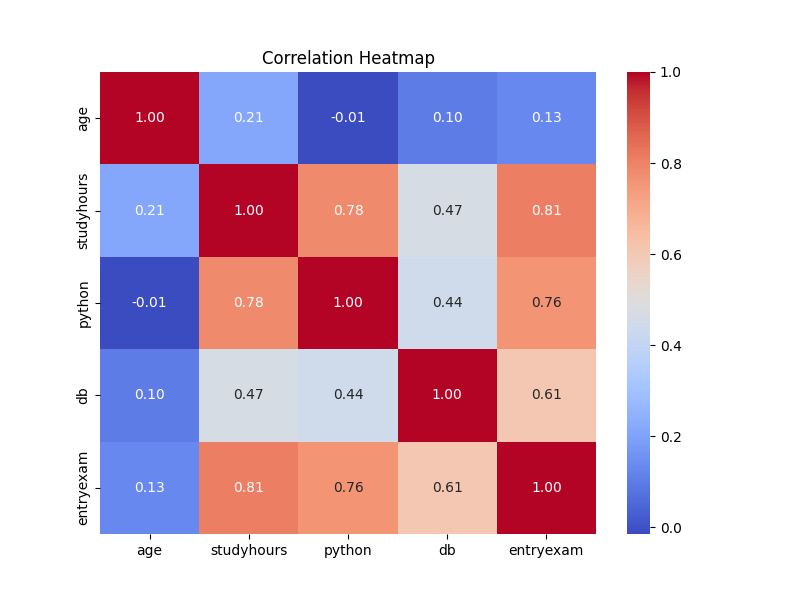
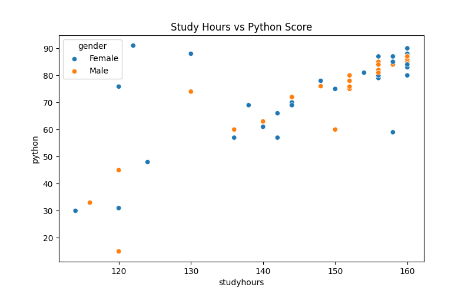
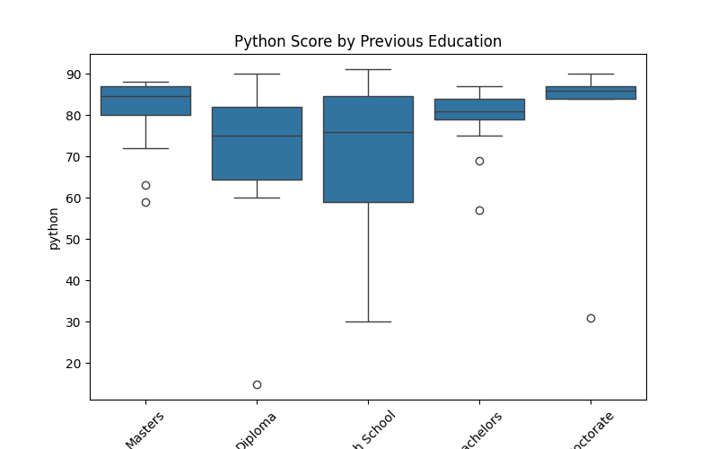

# Student Performance Analysis: Business Intelligence Programme

An end-to-end data cleaning and exploratory analysis project. I took a deliberately messy practice dataset of 77 student records, cleaned it separately in Excel, SQL, Python and R, then explored it in Python and Power BI to find out what drives students' results.

**Tools:** Excel, SQL (PostgreSQL), Python (pandas, seaborn, matplotlib), R (tidyverse), Power BI, Tableau

## The Data

Each record holds a student's age, gender, country, residence type, entry exam score, previous education, study hours, and final scores in Python and Database modules.

The dataset is a public practice dataset published by **Walekhwa Philip Tambiti Leo** ("Intro to Data Cleaning, EDA, and Machine Learning", October 2024). The names in it are computer-generated, not real students. His description of the dataset is kept in [`docs/dataset-description-walekhwa.html`](docs/dataset-description-walekhwa.html).

The raw file has the problems you find in real exports: inconsistent gender codes (`M`, `F`, `Male`), country spellings (`Norge`, `RSA`), residence labels (`BI-Residence`, `BIResidence`), mixed-case column headers and missing scores.

## What I Found



- **Study hours and entry exam scores are the strongest signals.** Study hours correlate with Python score at 0.78 and entry exam score at 0.76.
- **Previous education matters.** Students with bachelor's (average 80.0) and master's degrees (81.2) scored higher in Python than those from high school (69.6) or diploma (70.1) routes, and far more consistently.
- **Residence type shows a gap, but a small one.** Sognsvann residents averaged 81.4 in Python with the least spread, against 74.3 for BI Residence and 75.3 for private housing. Only 12 students live in Sognsvann, so this is a lead to investigate, not a conclusion.
- **Python and Database scores are only moderately related** (0.44), so they measure related but different skills.
- **Age has no meaningful relationship** with performance (-0.01).




## Recommendations

1. Target academic support at students entering from high school and diploma routes.
2. Encourage structured study time, since study hours track closely with results.
3. Look into why Sognsvann residents score higher and more consistently (study space, peer support or who is placed there) before acting on it, given the small group.

## Repository Structure

| Folder | Contents |
|---|---|
| [`data/`](data/) | Raw dataset and the cleaned outputs from Python and R |
| [`python/`](python/) | `clean_data.py` (first cleaning pass) and `eda.py` (final standardisation, correlations and charts) |
| [`r/`](r/) | `clean_data.R`, the same cleaning in the tidyverse |
| [`excel/`](excel/) | Programme strategy workbook |
| [`powerbi/`](powerbi/) | Power BI report (`BI_Student_Performance_Report.pbix`) and working file |
| [`images/`](images/) | Charts exported from the Python analysis |
| [`docs/`](docs/) | Full project report and the dataset author's description |

## How to Run the Python Analysis

```bash
pip install pandas seaborn matplotlib
python python/clean_data.py
python python/eda.py
```

The R script runs from the repository root with `Rscript r/clean_data.R`.

## Author

Prides Maboh | [LinkedIn](https://www.linkedin.com/in/prides-tumasang-fru-maboh) | fruprides@outlook.com
